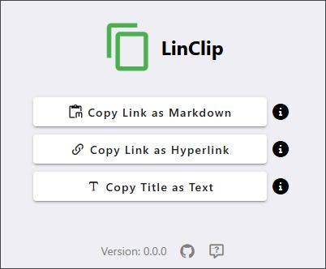

# LinClip - WebページのURLコピー拡張

LinClipは、WebページのURLをMarkdown形式やHTMLリンク形式で簡単にコピーできるChrome拡張です。



## 特徴

- WebページのタイトルとURLを取得し、簡単にクリップボードへコピー
- Markdown形式 (`[タイトル](URL)`) やHTMLリンク (`<a href='URL'>タイトル</a>`) でコピー可能
- シンプルなUIで直感的に操作可能
- Vue 3 + TypeScript + Vuetifyを使用

## 使用方法

1. 拡張機能のアイコンをクリック
2. コピーしたいフォーマット（Markdown / ハイパーリンク / テキスト）を選択
3. クリップボードにコピーされるので、好きな場所に貼り付け

## 開発

このプロジェクトは以下の技術を使用しています。

- **フロントエンド:** Vue 3 + TypeScript
- **スタイル:** Vuetify
- **ビルドツール:** Vite
- **テスト:** Vitest

1. このリポジトリをクローンする
   ```sh
   git clone git@github.com:dot-ma801/LinClip.git
   cd LinClip
   ```
1. [`env.example`](./.env.example) をコピーして、`.env`を作成し、必要項目を記載する
1. 依存関係をインストールする
   ```sh
   npm install
   ```

### 開発サーバーの起動

1. 開発環境を起動する
   ```sh
   npm run dev
   ```

### 資材の作成

1. ビルドを実行する
   ```sh
   npm run build
   ```
1. Chromeの「拡張機能を管理」画面で「デベロッパーモード」をオンにし、「パッケージ化されていない拡張機能を読み込む」から `dist/` フォルダを選択する

### コードのフォーマット・Lint

```sh
npm run lint  # ESLintでコードチェック
npm run format  # Prettierでフォーマット
```

### 本番ビルド

```sh
npm run build
```

### ユニットテスト

```sh
npm run test:unit
```

🤖 このドキュメントは生成AIによって作成されました
